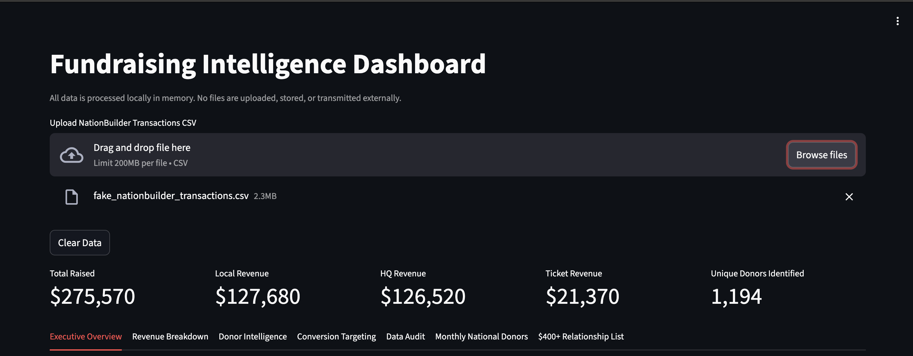

# Fundraising Intelligence

<p align="center">
  
</p>

Fundraising Intelligence is a local analytics dashboard for **NationBuilder transaction exports** used by political campaigns and EDAs.

It helps teams understand donor behaviour, revenue sources, outreach opportunities, and annual contribution limits without sending donor data to any external service.

## What It Does

Given a NationBuilder transactions export, the app can:

- Break down revenue by source, including local, national, and event donations
- Identify core local donors
- Flag national donors who may convert locally
- Detect recurring national donors
- Generate outreach and call-list targets
- Track annual donation limits

All analysis runs locally on the user's machine.

## Choose a Start Path

### Option 1: Download the Desktop App

If you want the fastest setup, download the packaged desktop release from the repo's Releases page.

The desktop app includes a sample dataset so you can explore the dashboard immediately.

### Option 2: Run From Source

Clone the repository:

```bash
git clone https://github.com/ThomasRoyProjects/Fundraising_Intelligence
cd Fundraising_Intelligence
python3 -m venv .venv
. .venv/bin/activate
pip install -r app/requirements.txt
```

Generate demo data:

```bash
python app/generate_demo_data.py
```

Run the dashboard:

```bash
streamlit run app/fundraising_dashboard.py
```

Then upload the generated demo CSV inside the app.

## Desktop Build

The desktop version uses an Electron wrapper around the local Python dashboard.

Build steps:

```bash
npm install
npm run dump
npm run dist
```

Build output is written to `dist/`.

## Architecture

This project combines:

- A Python analytics app for data loading, transformation, and dashboard logic
- A local-only workflow so campaign data stays on the user's machine
- An Electron packaging layer for desktop distribution
- Demo data generation for fast testing and portfolio review

## Demo Data

If you do not have a NationBuilder export, generate sample data with:

```bash
python app/generate_demo_data.py
```

This creates:

```text
app/fake_nationbuilder_transactions.csv
```

## Tech Stack

- Python
- Streamlit
- pandas
- numpy
- Electron
- stlite desktop tooling

## Data Privacy

Fundraising Intelligence is designed for local-only processing.

The application:

- does not upload donor data
- does not require an external backend
- does not send campaign records to third-party APIs during analysis

## Project Structure

```text
app/
  fundraising_dashboard.py
  generate_demo_data.py
  requirements.txt
docs/
  dashboard_preview.png
```

## Why This Project Matters

Political and advocacy teams often work with messy fundraising exports but still need quick answers about donor concentration, conversion opportunities, and outreach priorities.

This project turns raw transaction exports into a usable local analysis tool with a deployable desktop build.

## Future Improvements

- Support additional CRM import formats
- Add more filtering and segmentation workflows
- Expand dashboard summaries and export options
- Add direct integrations where local-only workflows remain appropriate

## Disclaimer

This project assists campaigns in analyzing fundraising activity. Users remain responsible for complying with campaign finance and privacy requirements in their jurisdiction.
